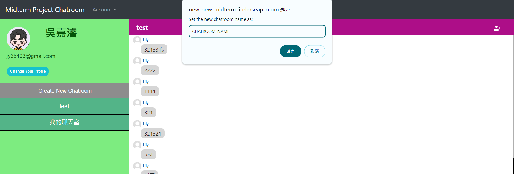

# Software Studio 2023 Spring Midterm Project

### Scoring

| **Basic components**                             | **Score** | **Check** |
| :----------------------------------------------- | :-------: | :-------: |
| Membership Mechanism                             | 15%       | Y         |
| Firebase page                                    | 5%        | Y         |
| Database read/write                              | 15%       | Y         |
| RWD                                              | 15%       | Y         |
| Chatroom                                         | 20%       | Y         |

| **Advanced tools**                               | **Score** | **Check** |
| :----------------------------------------------- | :-------: | :-------: |
| Using React                                      | 10%       | Y         |
| Third-Party Sign In                              | 1%        | Y         |
| Notification                                     | 5%        | Y         |
| CSS Animation                                    | 2%        | Y         |
| Security                                         | 2%        | Y         |

| **Other useful functions**                         | **Score** | **Check** |
| :----------------------------------------------- | :-------: | :-------: |
| User profile                                     | 1~5%      | Y         |
| Profile picture                                  | 1~5%      | Y         |

---

### How to setup your project

* First, download my **Midterm_Project_109021115.zip** and unzip it.
* Open the directory with VSCode and open the terminal.
* Make sure the current directory is **Midterm_Project_109021115**. It would be something like this:
* Then type the following commands:
    1. npm install
    2. npm run build
    3. firebase login
    4. firebase init
        1. Check the following 3 items.
        
        2. Choose the project named: **new-new-midterm**
        3. Remember to type public directory as **build**
        
    5. firebase serve
* Finally, you will get a URL something like http://localhost:5000, and this is the way to setup my project locally.

### How to use 

* In the beginning, click the **Account** button in the navbar, and click **Sign In/Up** button to go to the **Sign In/Up** page. You can sign up with your email or just sign in with Google account.

* After sign in, you will go to the **chatroom page**, and it would look like this:

* For **Account** button in navbar, you can click it to see your user profile, and you can also click **Sign Out** button here to log out.
* For the left part:
    * From top, you can see the user's profile picture and the user's name and email.
    * Under that, it is a button to let you change your profile picture.
    * Then, there's a **Create New Chatroom** button to create chatroom, it will look like this:
    
    * For the rest part, they are all chatrooms the user joined.
* For the right part:
    * From top, it shows the name of the chatroom. And on the right end, it's a button to add new member to the current chatroom with his/her email.
    * For the middle part, it's the chatroom and show the whole message history of it, you can scroll up and down to see every message.
    * On the bottom, it's the place you can input message. Upon pressing **Enter** or clicking on the **arrow sign**, you can send the message.
* When you use **Chrome** and open website locally:
    1. If you are **currently in the same chatroom where you receive a message**,
    2. or you **add new member to the chatroom**,
    each of the above 2 ways will let you get a **notification**.
* CSS animation is at the **Sign In/Up page**, the moving **Welcome To My Chatroom**:
    

### Function description

* User profile:
    * User can see his/her own **name** and **email** from navbar and the top left part of the chatroom page. Also, the user are able to see who sent the message with **sender's name and profile picture**:
    
* Profile picture:
    * User can set his/her own profile picture by pressing the **Change Your Profile** button.
    
    * The **default picture** is on the following:
    

### Firebase page link

- [Link](https://new-new-midterm.firebaseapp.com/)

### Others (Optional)

- Thank you, TAs.

