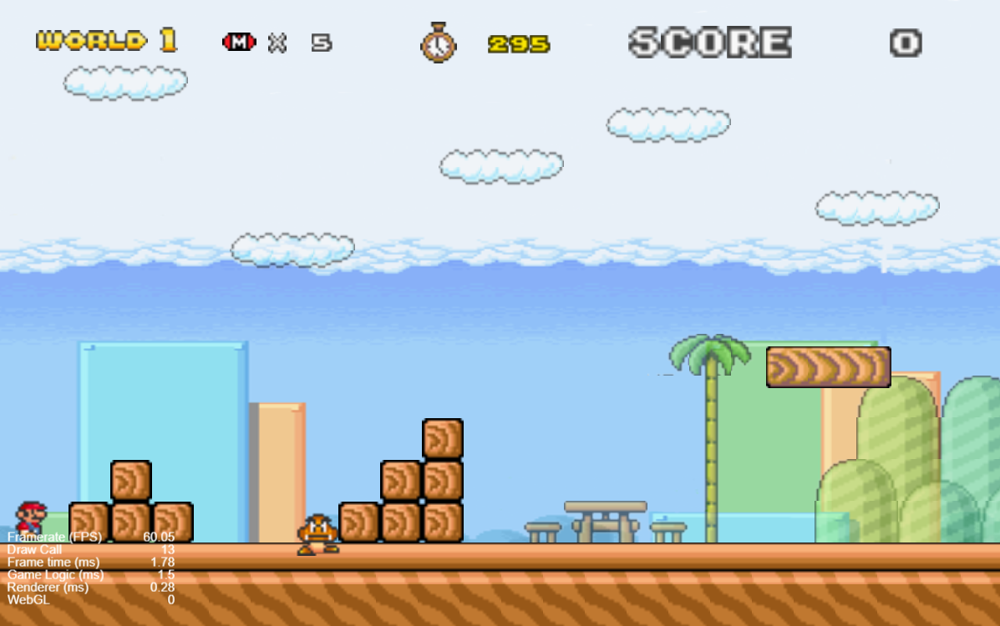
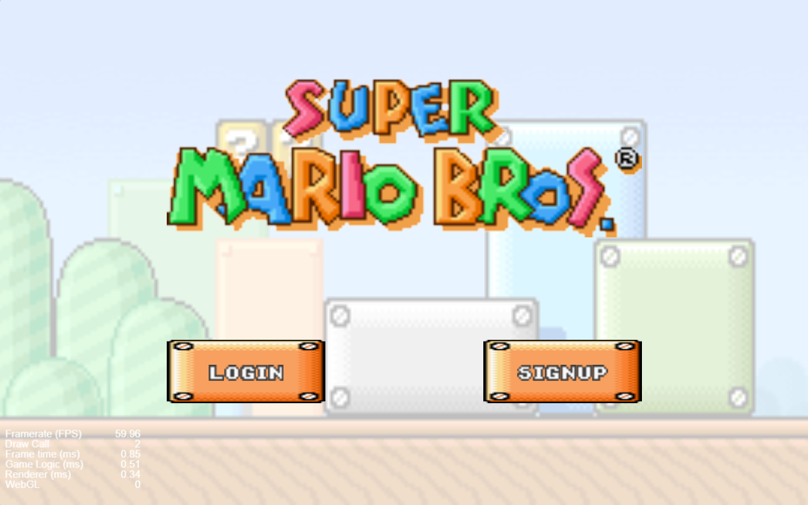
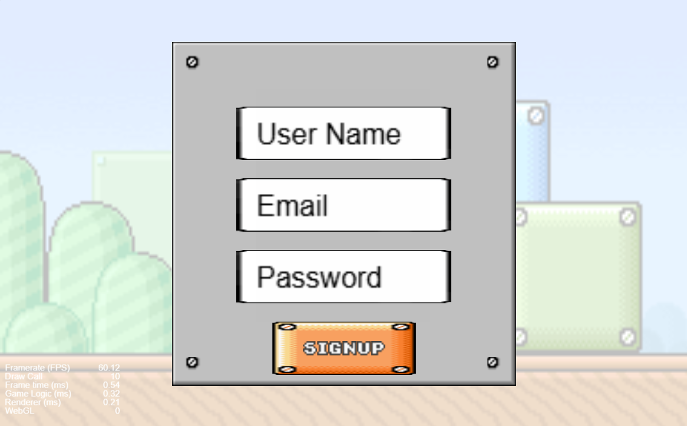
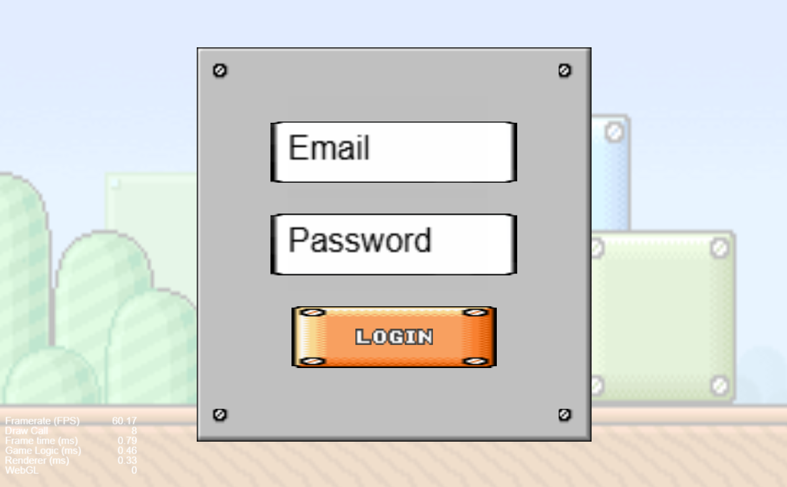

# Software Studio 2024 Spring Assignment 2

## Student ID : 109021115 Name : 吳嘉濬

### Scoring

|**Basic Component**|**Score**|**Check**|
|:-:|:-:|:-:|
|Complete Game Process|5%|Y|
|Basic Rules|55%|Y|
|Animations|10%|Y|
|Sound Effects|10%|Y|
|UI|10%|Y|

|**Advanced Component**|**Score**|**Check**|
|:-:|:-:|:-:|
|firebase deploy|5%|Y|
|Leaderboard|5%|N|
|Offline multi-player game|5%|N|
|Online multi-player game|10%|N|
|Others [name of functions]|1-10%|N|

---

## Basic Components Description : 
1. World map : 
    * There is 1 level.
    * The world map has correct physics properties.
    * Background and Camera will follow the player's(Mario's) position to make him stay at the middle, except the player(Mario) is on the edge of the map.
2. Player : 
    * Player has correct physics properties.
    * **Player can go left and right by pressing key LEFT and key RIGHT, and can jump by pressing key UP or key SPACE.**
    * When player get attacked by enemy,
        1. if you are now a big Mario, you will shrink to small Mario and then have **invincibility time**(the time interval that the player CANNOT be damaged) for 1 second.
        2. if you are now a small Mario, you will lose 1 life.
    * When player get out of the bounds, no matter you are now big or small Mario, you will lose 1 life.
    * When player lose 1 life, the player will reborn at the initial position.
3. Enemies : 
    * There is 1 type of enemies, Goomba.
    * The enemies have correct physics properties.
    * The damage detection is set correctly.
4. Question Blocks : 
    * There is 1 type of question blocks, the one that generates super mushroom.
    * Question blocks can interact with player correctly.
5. Animations : 
    * Player has **walk**, **jump**, and **die** animation, moreover, when **eating super mushroom to get bigger** or **damaged to get shrink(form big Mario to small Mario)**, they both have animations.
    * Enemy goomba has **walk** and **die** animation.
    * The question block has vertical **shake** animation when got hit from the bottom.
6. Sound effects : 
    * There are in total 2 BGMs in the game, when at
        * start menu,
        * sign up,
        * log in,
        * level select,
        * gameplay scene,
        there is always a looping BGM.
    * When player
        * **jump**,
        * **die(lose 1 life)**,
        * **eat super mushroom**,
        * **eat super mushroom *when already big Mario(different sound effect)***,
        * **shrink**(from big Mario to small Mario),
        * **step on Goomba**,
        * **win the level**,
        * **gameover**,
        they have corresponding sound effects.
    * When question blocks got hit from the bottom, there is a **super mushroom generation** sound effects.
7. UI : 
    
    * We can see the UI is on the top of the gameplay scene. From left to right, there are:
        * World number: indicating which level the player is at
        * Player life: the number of life that the player has
        * Timer: the number of time left to the level
        * Player score: the score that the player currently has:
            * kill a Goomba will get 100 score,
            * eat a super mushroom will get 1000 score,
            * when finishing the level with **T** seconds left, the player will get additional **100*T** score.

## Advanced Component Description : 

1. Firebase : 
    * The project is properly deploy to Firebase.
    * In the begining of the game, you will see the scene like the following. You can press SIGNUP button to sign up, or press LOGIN button to log in.
    
    * If you want to sign up, you need to fill your new **user name**, **email**, and **password**, the sign up scene is at the following:
    
    * If you want to log in, you need to fill your **email**, and **password**, the log in scene is at the following:
    
    * No matter you choose to sign up or log in, after signing up / logging in, you will be direct to level select scene.

# Firebase page link (if you deploy)

[URL link](https://mario-573c7.firebaseapp.com/)